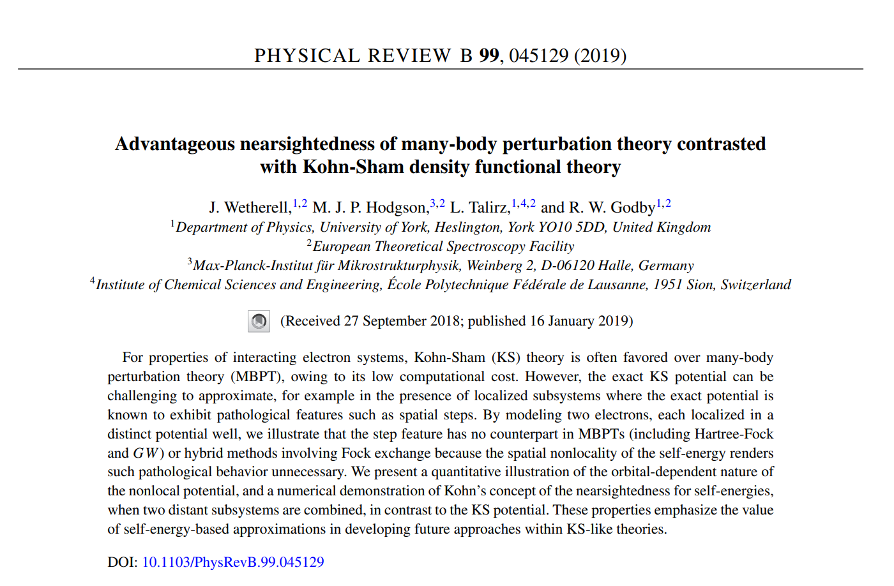

# Advantageous Nearsightedness

This repository allows you to reproduce the results of, and interact with the paper: Advantageous nearsightedness of many-body perturbation theory contrasted with Kohn-Sham density functional theory.

- [Paper](https://journals.aps.org/prb/abstract/10.1103/PhysRevB.99.045129).
- [Preprint](https://arxiv.org/pdf/1812.02661.pdf).
- [Reprint](https://jackwetherell.github.io/files/nearsightedness.pdf).



## Requirements

- iDEA-latest
- numpy
- matplotlib

## Installation

`pip install -r requirements.txt`

## Usage

`cd notebooks`

`jupyter lab`

## Directory structure
```
|-- README                         <- Project README
|-- requirements.txt               <- Project dependencies
|-- data                           <- Project data
|   |-- raw                        <- Raw data
|   |-- input                      <- Input data
|   |-- output                     <- Output data
|-- notebooks                      <- Jupyter notebooks
|-- advantageous_nearsightedness   <- Source files
```
